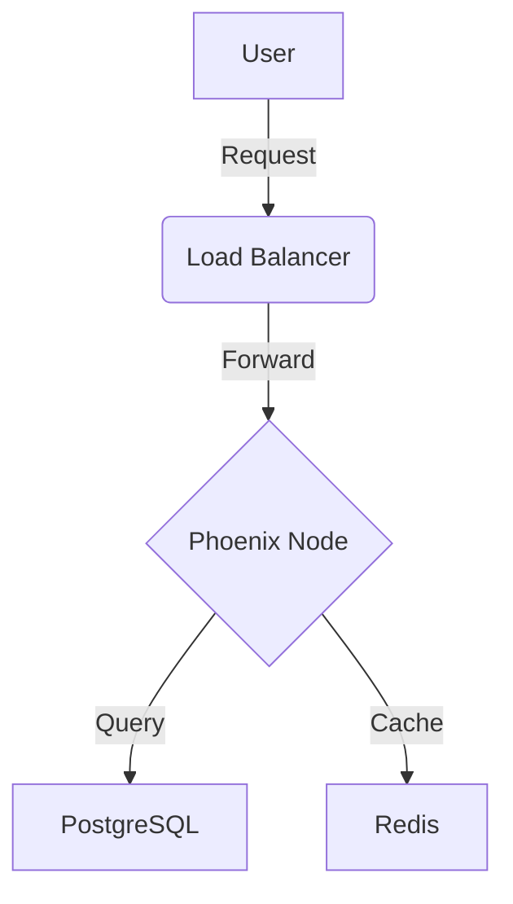

# Advanced Features

This guide demonstrates more complex features of our application and how to document them effectively using ExDoc.

## LiveView Components

We use Phoenix LiveView for real-time interactivity. Here is an example of a functional component:

```elixir
defmodule ElixirT1Web.CoreComponents do
  use Phoenix.Component

  @doc """
  Renders a simple button.
  """
  attr :type, :string, default: "button"
  attr :class, :string, default: nil
  slot :inner_block, required: true

  def button(assigns) do
    ~H"""
    <button
      type={@type}
      class={[
        "phx-submit-loading:opacity-75 rounded-lg bg-zinc-900 hover:bg-zinc-700 py-2 px-3",
        "text-sm font-semibold leading-6 text-white active:text-white/80",
        @class
      ]}
    >
      <%= render_slot(@inner_block) %>
    </button>
    """
  end
end
```

## Data Structures

Here is a breakdown of the user data structure:

| Field | Type | Description |
| :--- | :--- | :--- |
| `id` | `integer` | Unique identifier |
| `email` | `string` | User's email address |
| `inserted_at` | `datetime` | Creation timestamp |

## Important Notes

> [!INFO]
> Remember to always validate user input before processing it.

> [!WARNING]
> This is a warning block. Be careful when handling sensitive data.

## Mermaid Diagrams

ExDoc supports Mermaid diagrams for visualizing flows:


